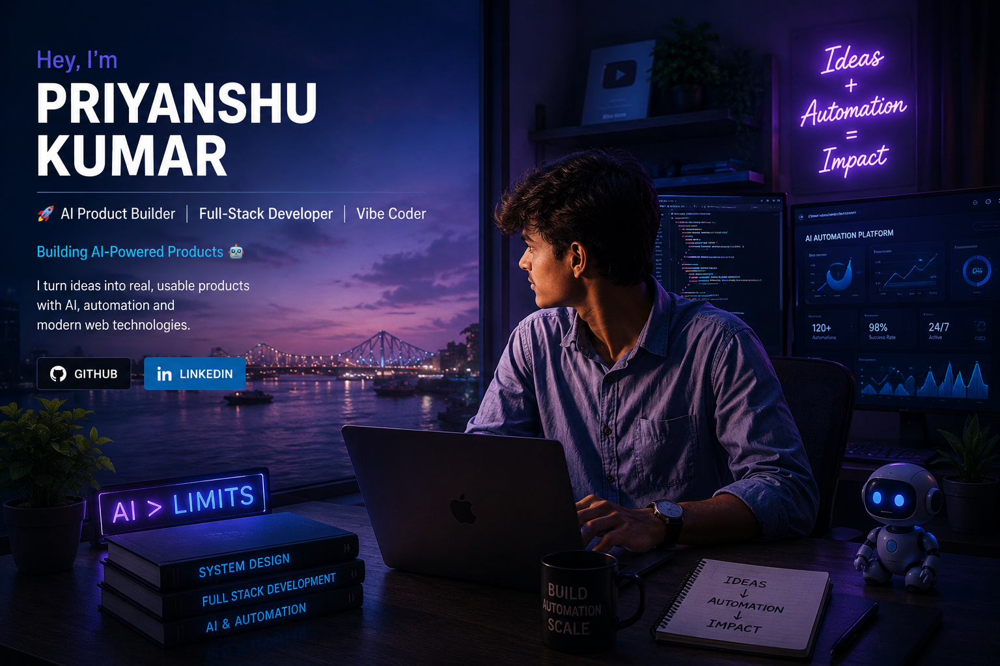

<div align="center">



</div>

<br>


<div align="center">

# 👋 Hey, I'm Priyanshu Kumar

### 🚀 AI Product Builder | Full-Stack Developer | Vibe Coder

<p align="center">
  
</p>

I turn ideas into **real, usable products** with AI, automation and modern web technologies.

<br/>

[](https://github.com/priyanshu4429-cloud)
[](https://www.linkedin.com/in/priyanshu-mehta-58959834b?utm_source=share_via&utm_content=profile&utm_medium=member_android)

</div>

---

## 🧠 About Me

I'm a developer and builder who enjoys taking an idea from **concept → prototype → working product**.

My main interests are:

- 🤖 Artificial Intelligence & LLM-powered applications
- ⚡ AI Agents & Automation
- 🌐 Full-Stack Web Development
- 🚀 Startup & Product Development
- 🏆 Hackathons & Rapid Prototyping
- 🧪 Experimenting with new technologies

I believe the best way to learn is to **build, break, improve, and ship.**

---

## 🚀 What I'm Building

### 🤖 AI Agency Automation

An AI-powered platform focused on automating repetitive business workflows and making processes more efficient.

**Areas of focus:**

- 🔎 Lead Discovery
- 🤖 AI Agents
- ⚡ Workflow Automation
- 📊 Lead Management
- 📩 Outreach Automation
- 🧠 AI-powered decision making

> Building toward a system where AI handles repetitive work while humans focus on important decisions.

---

## 🛠️ Technologies & Tools

### 💻 Development


### 🌐 Web


### 🤖 AI & Automation


### 🔧 Tools


---

## ⭐ Featured Projects

### 🤖 AI Agency Automation Platform

AI-powered automation platform for discovering leads and streamlining repetitive business workflows.

**Focus:** AI • Automation • Agents • Product Development

---

### 🏆 Hackathon Projects

I build practical solutions for real-world problems under hackathon constraints, focusing on rapid prototyping, AI integration and product thinking.

**Focus:** AI • Innovation • Rapid Prototyping

---

## 🧩 How I Build

```text
💡 Idea
   ↓
📝 Plan
   ↓
⚡ Prototype
   ↓
🧠 Add AI / Automation
   ↓
🧪 Test
   ↓
🔧 Improve
   ↓
🚀 Ship## Hi there 👋

<!--
**priyanshu4429-cloud/priyanshu4429-cloud** is a ✨ _special_ ✨ repository because its `README.md` (this file) appears on your GitHub profile.

Here are some ideas to get you started:

- 🔭 I’m currently working on ...
- 🌱 I’m currently learning ...
- 👯 I’m looking to collaborate on ...
- 🤔 I’m looking for help with ...
- 💬 Ask me about ...
- 📫 How to reach me: ...
- 😄 Pronouns: ...
- ⚡ Fun fact: ...
-->
